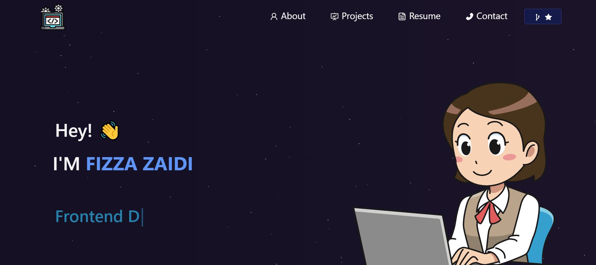

<h1 align="center"> Web Applications (PWA) Challenge: Budget Tracker 👋</h1>
  

    
    
    
    
    
    

  

    
    
    
    
    

   
<h4>Designed and coded by <a href="https://github.com/fizzaaz">FIZZA ZAIDI</a></h4> 

## Description

🔍Being a web developer means being part of a community. You’ll need a place to share your projects not only if you're applying for jobs or working as a freelancer but also so that you can share your work with fellow developers and collaborate on future projects.

I have created a portfolio, using my new React skills to help set you apart from other developers whose portfolios don’t use the latest technologies.

✋ [GitHub Repository](https://github.com/fizzaaz/react-portfolio)

✋ [Deployed App](https://fizzaaz.github.io/react-portfolio/)

## ✋User Requirements

AS AN employer looking for candidates with experience building single-page applications
I WANT to view a potential employee's deployed React portfolio of work samples
SO THAT I can assess whether they're a good candidate for an open position

## ✋Project Requirements

GIVEN a single-page application portfolio for a web developer
* WHEN I load the portfolio THEN I am presented with a page containing a header, a section for content, and a footer
* WHEN I view the header THEN I am presented with the developer's name and navigation with titles corresponding to different sections of the portfolio
* WHEN I view the navigation titles THEN I am presented with the titles About Me, Portfolio, Contact, and Resume, and the title corresponding to the current section is highlighted
* WHEN I click on a navigation title THEN I am presented with the corresponding section below the navigation without the page reloading and that title is highlighted
* WHEN I load the portfolio the first time THEN the About Me title and section are selected by default
* WHEN I am presented with the About Me section THEN I see a recent photo or avatar of the developer and a short bio about them
* WHEN I am presented with the Portfolio section THEN I see titled images of six of the developer’s applications with links to both the deployed applications and the corresponding GitHub repository
* WHEN I am presented with the Contact section THEN I see a contact form with fields for a name, an email address, and a message
* WHEN I move my cursor out of one of the form fields without entering text THEN I receive a notification that this field is required
* WHEN I enter text into the email address field THEN I receive a notification if I have entered an invalid email address
* WHEN I am presented with the Resume section THEN I see a link to a downloadable resume and a list of the developer’s proficiencies
* WHEN I view the footer THEN I am presented with text or icon links to the developer’s GitHub and LinkedIn profiles, and their profile on a third platform (Stack Overflow, Twitter) 

## Table of Contents
- [Description](#description)
- [User Requirements](#user-requirements)
- [Project Requirements](#project-requirements)
- [Installation](#installation)
- [Usage](#usage)
- [Testing](#testing)
- [Contribution](#contribution)
- [Questions](#questions)

## 💻Usage
  
Run the following command at the root of your project :
  
`npm start`     

To access the app after starting the server, go to http://localhost:3000 in your browser or go to https://fizzaaz.github.io/react-portfolio/

## 💾Installation

`npm start`

## ✏️Testing

No testing is currently set up

## 👪Contribution

  Email me 

## Questions

 If you have any queries feel free to contact me at ✉️ fizz.zehra14@gmail.com.
 You can also reach me out through my Github profile at  👋[fizzaaz](https://github.com/fizzaaz/).

